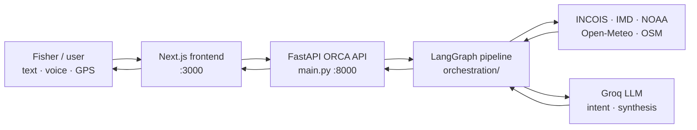
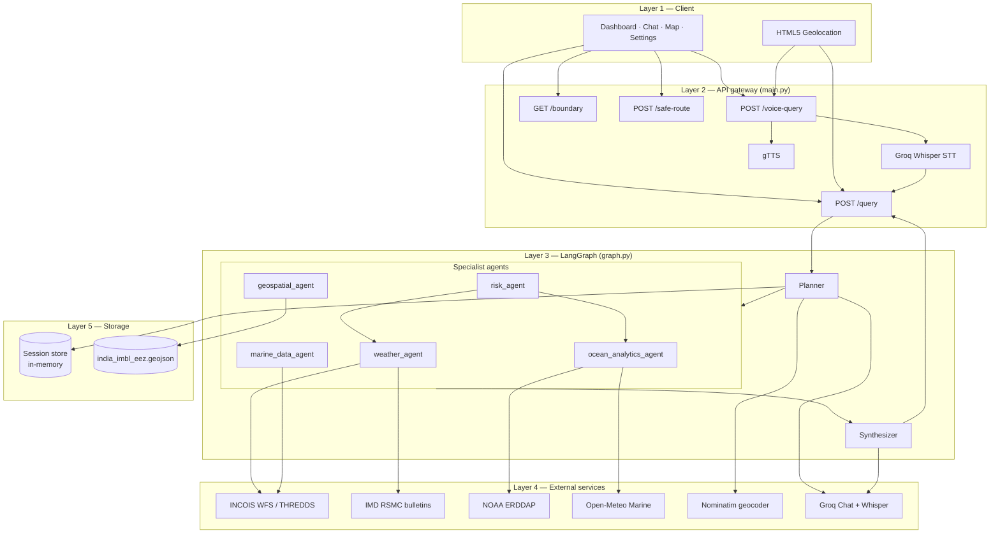
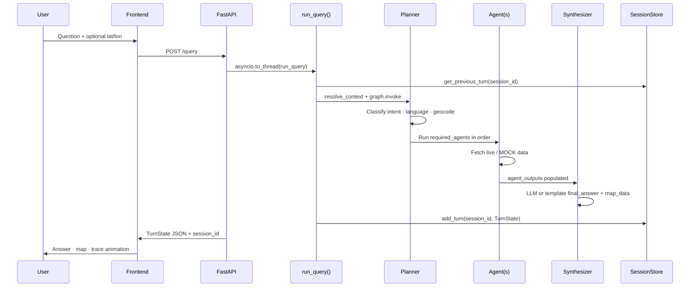
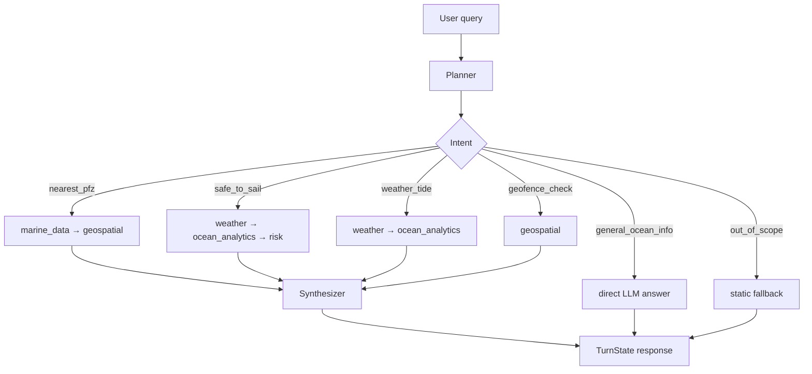
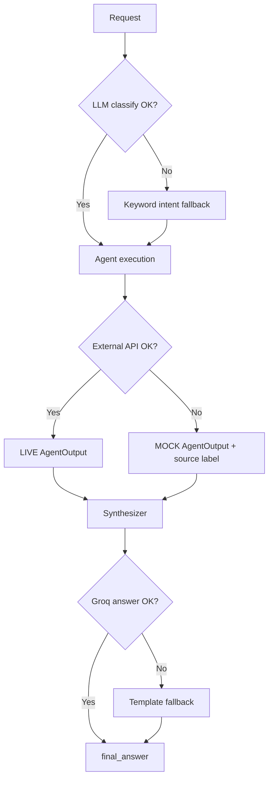

# ORCA — Ocean Response & Coastal Assistant

**Smart India Hackathon 2026 · Problem Statement PS-176**

ORCA is a multilingual marine intelligence platform for Indian coastal communities and fishing crews. It combines a **LangGraph multi-agent orchestrator**, **live data from INCOIS and IMD**, and a **Next.js dashboard** so users can ask natural-language questions (text or voice), see PFZ advisories and weather on a map, check IMBL/EEZ geofence status, and get **IMD/INCOIS-aligned safety verdicts**—with transparent data sources and graceful fallbacks when APIs are unavailable.

> **Not for navigation.** Boundaries, routes, and risk outputs are decision-support only. Always follow official advisories from INCOIS, IMD, and local authorities.

---

## Table of contents

| | |
|---|---|
| [Why ORCA](#why-orca) | [Features](#features-at-a-glance) |
| [Architecture](#architecture) | [Intent routing](#intent--agent-routing) |
| [Repository layout](#repository-layout) | [Tech stack](#tech-stack) |
| [Data sources](#live-data-sources) | [API reference](#api-reference) |
| [Quick start](#quick-start) | [Configuration](#configuration) |
| [Frontend app](#frontend-application) | [Testing](#testing) |
| [Resilience & fallbacks](#resilience--fallback-behavior) | [Further documentation](#further-documentation) |

---

## Why ORCA

Coastal fishermen need **timely, trustworthy** answers about PFZ locations, sea state, cyclone alerts, and maritime boundaries—often in **regional languages**, sometimes **hands-free** on a boat. ORCA addresses this by:

1. **Routing** each question to the right specialist agents (not one monolithic LLM guess).
2. **Fetching** public marine APIs where possible and labeling every field with `source` (`INCOIS`, `IMD`, `NOAA`, `Open-Meteo`, or `MOCK`).
3. **Synthesizing** a concise, conversational answer (Groq LLM) in the user’s detected language.
4. **Showing** map layers, agent reasoning traces, and optional voice I/O for demos and field use.

---

## Features at a glance

| Capability | Description |
|------------|-------------|
| **Natural-language Q&A** | Text chat with multi-turn session memory (`session_id`) |
| **Voice queries** | Groq Whisper STT → pipeline → gTTS audio (`/voice-query`) |
| **PFZ discovery** | Nearest Potential Fishing Zones from INCOIS WFS |
| **Safety assessment** | Wind, wave, swell, cyclone → `safe` / `caution` / `unsafe` |
| **Ocean analytics** | SST, chlorophyll (and documented MLD baseline where APIs gap) |
| **Geofencing** | Distance to India EEZ/IMBL; `safe` / `approaching` / `crossed` |
| **Safe route** | Suggested path toward nearest PFZ from current GPS |
| **Interactive map** | Leaflet: PFZ markers, boundary polylines, user location |
| **Agent trace UI** | Step-by-step planner → agents → synthesizer visibility |
| **i18n UI** | English, Hindi, Tamil, Telugu (chrome); answers follow query language |
| **Resilient demos** | Keyword/LLM planner fallback; mock data on network failure |

---

## Architecture

### End-to-end flow (presentation view)



### System layers



### Pipeline sequence (single turn)



---

## Intent → agent routing

The **Planner** (`orchestration/planner.py`) classifies each query (Groq LLM with keyword fallback) and sets `required_agents`. Agents run **sequentially** in that list, then the **Synthesizer** always runs last.

| Intent | Typical user question | Agents invoked (in order) |
|--------|----------------------|---------------------------|
| `nearest_pfz` | “Where is the nearest fishing zone?” | `marine_data_agent` → `geospatial_agent` |
| `safe_to_sail` | “Is it safe to sail today?” | `weather_agent` → `ocean_analytics_agent` → `risk_agent` |
| `weather_tide` | “Waves and wind near Kochi?” | `weather_agent` → `ocean_analytics_agent` |
| `geofence_check` | “Am I inside India’s EEZ?” | `geospatial_agent` |
| `general_ocean_info` | General marine knowledge | *(none — synthesizer uses Groq directly)* |
| `out_of_scope` | Non-marine topics | *(none — static fallback + translation)* |



Shared state contract: **`TurnState`** in `orchestration/state.py` (see [CONTRACTS.md](./orchestration/CONTRACTS.md) for per-agent `data` field schemas).

---

## Repository layout

```
SIH---2026-PS---176-/
├── main.py                          # FastAPI app — HTTP entry point
├── .env.example                     # GROQ_API_KEY template
├── .python-version                  # Python 3.11.9
├── architecture_flowcharts.md       # Extended Mermaid diagrams + handoff notes
├── AGENTS_LIVE_DATA_STATUS.md       # Per-agent live vs MOCK documentation
│
├── orchestration/
│   ├── graph.py                     # LangGraph compile + run_query()
│   ├── planner.py                   # Intent, language, geocode, follow-ups
│   ├── synthesizer.py               # Final answer + map_data builder
│   ├── state.py                     # TurnState, AgentOutput, TraceEntry
│   ├── session_store.py             # Multi-turn memory (in-process)
│   ├── localization_pipeline.py     # Groq Whisper STT + gTTS helpers
│   ├── CONTRACTS.md                 # Agent I/O schemas (team handoff)
│   ├── requirements.txt
│   ├── data/
│   │   └── india_imbl_eez.geojson   # India EEZ (generate via scripts/ if missing)
│   ├── agents/
│   │   ├── weather_agent.py
│   │   ├── marine_data_agent.py
│   │   ├── ocean_analytics_agent.py
│   │   ├── risk_agent.py
│   │   ├── geospatial_agent.py
│   │   └── productivity_agent.py    # Catch-history correlation (optional)
│   └── tests/
│       ├── test_graph.py
│       ├── test_planner.py
│       └── test_session_memory.py
│
├── frontend/                        # Next.js 16 App Router
│   ├── app/
│   │   ├── page.js                  # Redirect → /dashboard
│   │   └── (app)/
│   │       ├── dashboard/           # Overview, stats, quick actions
│   │       ├── chat/                # Chat + voice + agent trace
│   │       ├── map/                 # Leaflet map explorer
│   │       ├── saved/               # Local query history
│   │       └── settings/            # Units, geo, preferences
│   ├── components/                  # MapView, ChatPanel, charts, shell UI
│   ├── lib/
│   │   ├── api.js                   # Backend client (/query, /voice-query, …)
│   │   ├── store.js                 # Global Orca context + geo
│   │   └── i18n/                    # en · hi · ta · te UI strings
│   └── package.json
│
└── scripts/
    └── ingest_marine_regions_eez_v12.py   # Build india_imbl_eez.geojson from EEZ v12
```

---

## Tech stack

| Layer | Technologies |
|-------|----------------|
| **Frontend** | Next.js 16, React 19, Leaflet / react-leaflet, CSS Modules |
| **API** | FastAPI, Uvicorn, CORS (permissive for local demos) |
| **Orchestration** | LangGraph, Pydantic v2 `TurnState` |
| **LLM / speech** | Groq (`GROQ_API_KEY`) — chat, Whisper transcription |
| **TTS** | gTTS |
| **Geospatial** | Shapely, GeoJSON EEZ boundaries, Haversine distances |
| **Scientific I/O** | xarray, netCDF4 (ocean analytics fallbacks) |
| **Testing** | pytest |

---

## Live data sources

| Agent | Primary sources | Auth |
|-------|-----------------|------|
| **weather_agent** | [INCOIS THREDDS WW3 WMS](https://incois.gov.in/thredds/wms/osf/ww3), [IMD RSMC](https://rsmcnewdelhi.imd.gov.in) cyclone bulletins | Public |
| **marine_data_agent** | [INCOIS GeoServer PFZ WFS](https://incois.gov.in/geoserver/PFZ_Automation/ows) | Public |
| **ocean_analytics_agent** | [Open-Meteo Marine](https://marine-api.open-meteo.com), NOAA CoastWatch ERDDAP | Public |
| **risk_agent** | Derived from weather + ocean outputs; thresholds tied to IMD/INCOIS criteria | — |
| **geospatial_agent** | Local `india_imbl_eez.geojson` (Marine Regions EEZ v12, `SOVEREIGN1 == India`) | Local file |
| **productivity_agent** | User-supplied catch observations (frontend); Pearson correlations | User data |

Every `AgentOutput` includes a **`source`** string so judges and users can distinguish **LIVE** fetches from **MOCK** fallbacks. Details: [AGENTS_LIVE_DATA_STATUS.md](./AGENTS_LIVE_DATA_STATUS.md).

---

## API reference

Base URL (default): `http://localhost:8000`

| Method | Path | Purpose |
|--------|------|---------|
| `GET` | `/` | API info and endpoint list |
| `GET` | `/health` | Liveness probe |
| `POST` | `/query` | Run full pipeline; body: `{ text, session_id?, latitude?, longitude? }` |
| `POST` | `/voice-query` | Multipart `audio` + optional `session_id`, `latitude`, `longitude`; returns TurnState + `transcribed_text` + optional `audio_b64` |
| `GET` | `/boundary` | India EEZ/IMBL polylines for map (`[lat, lon]` segments) |
| `POST` | `/safe-route` | Body: `{ latitude, longitude }` → `{ route, nearest_pfz }` |

**Response shape:** `TurnState` fields including `intent`, `language`, `required_agents`, `agent_outputs`, `trace`, `final_answer`, `citations`, `disclaimer`, `map_data`, plus top-level `session_id` on `/query` and `/voice-query`.

Interactive docs when the server is running: **`http://localhost:8000/docs`** (Swagger UI).

---

## Quick start

### Prerequisites

- **Python 3.11+** (repo pins **3.11.9** via `.python-version`)
- **Node.js 18+** and npm
- **Groq API key** ([console.groq.com](https://console.groq.com)) for LLM classification, synthesis, and voice transcription
- Internet access for INCOIS/IMD/public marine APIs during demos

### 1. Clone and configure environment

```bash
git clone https://github.com/Aarushtech-coder/SIH---2026-PS---176-.git
cd SIH---2026-PS---176-
cp .env.example .env
# Edit .env and set GROQ_API_KEY=...
```

### 2. Backend (port 8000)

```bash
python -m venv .venv
# Windows: .venv\Scripts\activate
# macOS/Linux: source .venv/bin/activate
pip install -r orchestration/requirements.txt
pip install groq gTTS   # voice pipeline (also used by main.py)

uvicorn main:app --reload --port 8000
```

Verify: `curl http://localhost:8000/health`

### 3. Frontend (port 3000)

```bash
cd frontend
npm install
npm run dev
```

Open **http://localhost:3000** (redirects to `/dashboard`).

Optional: point the UI at another API host:

```bash
# frontend/.env.local
NEXT_PUBLIC_API_BASE_URL=http://localhost:8000
```

### 4. EEZ boundary data (first-time / geospatial)

If `orchestration/data/india_imbl_eez.geojson` is missing, generate it from Marine Regions EEZ v12 shapefile:

```bash
pip install geopandas shapely fiona pyogrio
python scripts/ingest_marine_regions_eez_v12.py path/to/eez_v12.shp
```

---

## Configuration

| Variable | Required | Description |
|----------|----------|-------------|
| `GROQ_API_KEY` | **Yes** (full LLM path) | Planner classification, synthesizer, Whisper STT |
| `NEXT_PUBLIC_API_BASE_URL` | No | Frontend API base (default `http://localhost:8000`) |
| `MLD_URL_TEMPLATE` | No | Optional mixed-layer depth API template for ocean analytics |

Without `GROQ_API_KEY`, tests and keyword fallbacks still run; LLM-heavy paths degrade to templates/keywords (see tests with `monkeypatch.delenv("GROQ_API_KEY")`).

---

## Frontend application

| Route | Role |
|-------|------|
| `/dashboard` | Marine overview, quick questions, charts, link to last answers |
| `/chat` | Full assistant, voice recording, live agent trace panel |
| `/map` | PFZ layers, EEZ boundary, safe route, location controls |
| `/saved` | Browser-local saved queries |
| `/settings` | Language, units (km/nm), geolocation, data-source display toggles |

**State:** `frontend/lib/store.js` (`OrcaProvider`) holds geolocation, dashboard snapshot, saved queries, and coordinates passed to `/query`.

**Mock mode:** `frontend/lib/api.js` sets `USE_MOCK = false` for production demos against the real backend.

---

## Testing

From the repository root (with venv active and dependencies installed):

```bash
pytest orchestration/tests -q
```

Coverage includes graph routing for all intents, planner behavior, and session memory.

---

## Resilience & fallback behavior



Design rule ([CONTRACTS.md](./orchestration/CONTRACTS.md)): **agents must not crash the pipeline**—failures become labeled mock data and the synthesizer still returns a user-visible answer.

---

## Further documentation

| Document | Contents |
|----------|----------|
| [architecture_flowcharts.md](./architecture_flowcharts.md) | Full Mermaid set: data pipeline, deployment, error flows, component handoff |
| [orchestration/CONTRACTS.md](./orchestration/CONTRACTS.md) | Exact `agent_outputs` field names and types |
| [AGENTS_LIVE_DATA_STATUS.md](./AGENTS_LIVE_DATA_STATUS.md) | Live API endpoints, thresholds, resilience notes |
| [orchestration/README.md](./orchestration/README.md) | Orchestration layer overview for contributors |
| [README_ROLE_3.md](./README_ROLE_3.md) | Ocean analytics, risk, and productivity agent notes |

---

## Team & acknowledgements

Built for **Smart India Hackathon 2026 (PS-176)** with data stewardship from **INCOIS** and **IMD**, open geospatial datasets (**Marine Regions**, **OpenStreetMap Nominatim**), and **NOAA / Open-Meteo** marine APIs.

---

## Disclaimer

ORCA provides **informational** marine and weather summaries. It is **not** a certified navigation, search-and-rescue, or regulatory compliance system. EEZ boundaries are approximate. Always consult official INCOIS PFZ bulletins, IMD warnings, and local maritime authorities before putting to sea.
