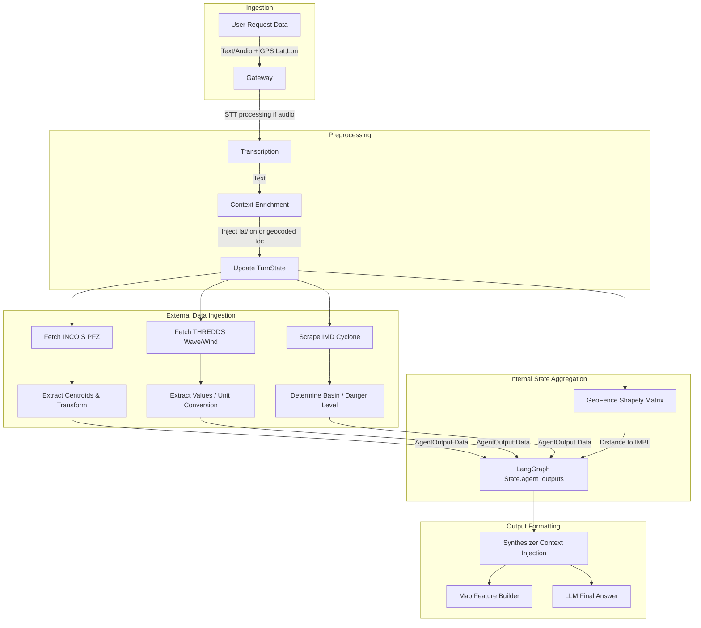
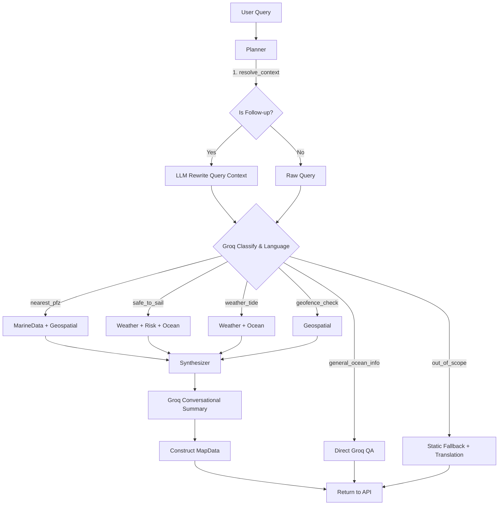
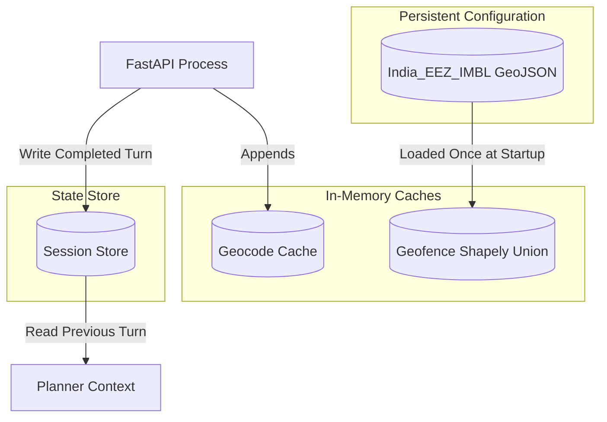
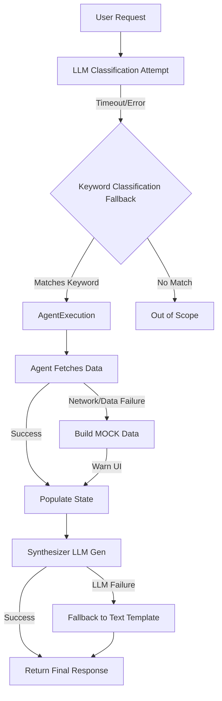
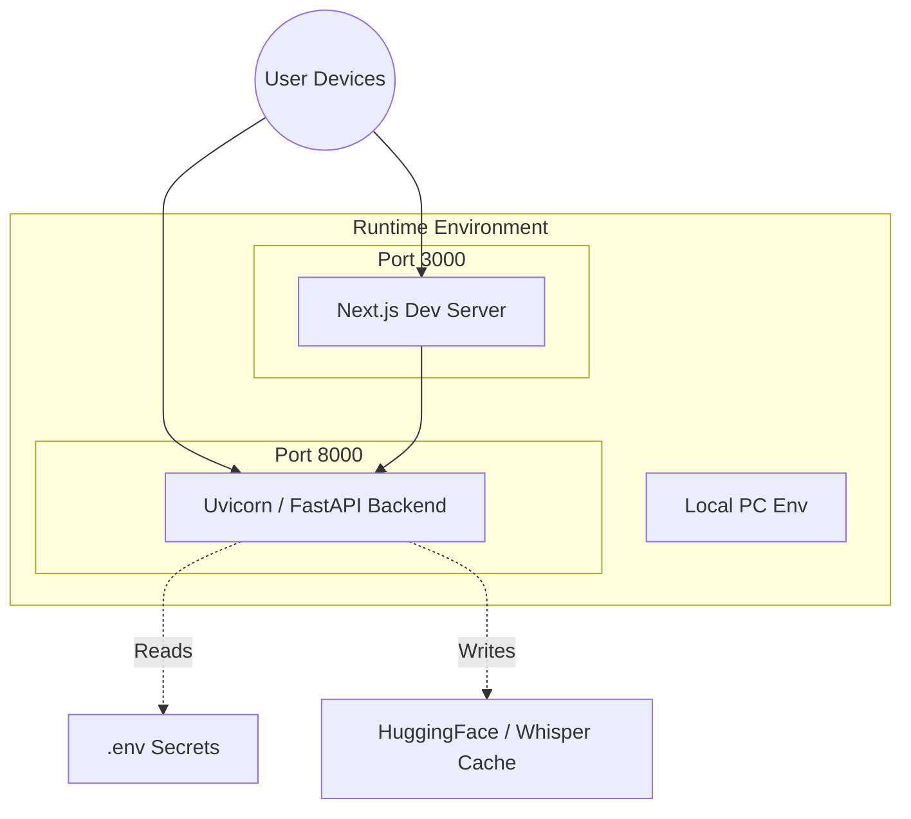
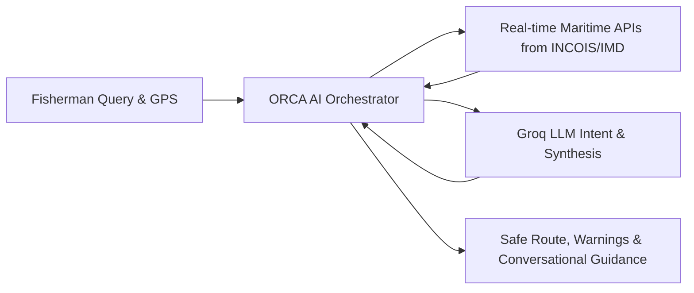

# ORCA Project Architecture & System Flow

## A. MASTER END-TO-END FLOWCHART

```mermaid
graph TD
    %% LAYER 1 — USERS / EXTERNAL SYSTEMS
    User((User / Fisherman))

    %% LAYER 2 — FRONTEND / INTERFACE
    subgraph Frontend [Next.js / React Frontend]
        UI[Web UI / Dashboard]
        Map[Leaflet MapView]
        Voice[Voice Recording / ChatPanel]
    end

    %% LAYER 3 — API / BACKEND
    subgraph API_Gateway [FastAPI Backend - main.py]
        Auth[CORS / Middleware]
        RouteQuery[/query POST]
        RouteVoice[/voice-query POST]
        STT[Whisper STT]
        TTS[gTTS TTS]
        Boundary[/boundary GET]
    end

    %% LAYER 4, 5, 6 — AI, AGENTS & ORCHESTRATION
    subgraph Orchestration [LangGraph Pipeline - orchestration/]
        Planner[Planner Node / Intent & Language]
        
        subgraph Agents
            MarineAgent[Marine Data Agent]
            GeoAgent[Geospatial Agent]
            WeatherAgent[Weather & Cyclone Agent]
            OceanAgent[Ocean Analytics Agent]
            RiskAgent[Risk Agent]
        end
        
        Synthesizer[Synthesizer Node / Final Answer LLM]
    end

    %% LAYER 6 — TOOLS / EXTERNAL SERVICES
    subgraph External_Services [External APIs & Models]
        Groq[Groq LLM API]
        INCOIS_WFS[INCOIS WFS - PFZ]
        INCOIS_WMS[INCOIS THREDDS WMS - Ocean State]
        IMD[IMD RSMC - Cyclone Bulletins]
        OSM[OSM Nominatim Geocoder]
    end

    %% LAYER 7 — DATABASE / STORAGE
    subgraph Storage [State & Memory]
        SessionStore[(Local Session Store / History)]
        GeoJSON[(Local GeoJSON Boundaries)]
    end

    %% FLOW CONNECTIONS
    User -->|Natural Language (Text/Audio)| Frontend
    UI -->|JSON Request| RouteQuery
    Voice -->|Audio BLOB| RouteVoice
    
    RouteVoice -->|Transcribe| STT
    STT -->|Transcribed Text| RouteQuery
    
    RouteQuery -->|Query + Context| Planner
    Planner -->|Session Memory Context| SessionStore
    SessionStore -->|Previous Turn| Planner
    Planner -->|Geocode text| OSM
    Planner -->|Detect Intent & Route| Groq
    
    Planner -->|Route to Specialist(s)| Agents
    
    MarineAgent -->|Fetch Advisories| INCOIS_WFS
    GeoAgent -->|Geoshape Intersects| GeoJSON
    WeatherAgent -->|Fetch Winds/Waves| INCOIS_WMS
    WeatherAgent -->|Scrape Bulletins| IMD
    
    Agents -->|AgentOutputs| Synthesizer
    Synthesizer -->|Generate & Translate Response| Groq
    Synthesizer -->|Populate Map Data| RouteQuery
    
    RouteQuery -->|JSON + Audio TTS (if voice)| Frontend
    RouteVoice -->|TTS Generates Audio| TTS
    
    Frontend -->|Render Map Features| Map
    Map -->|Display to User| User
```

## B. DETAILED DATA PIPELINE FLOW



## C. DETAILED AI / AGENT FLOW



## D. API + SERVICE COMMUNICATION FLOW

```mermaid
graph LR
    subgraph Client
        Browser[Next.js App]
    end

    subgraph FastAPI Backend
        API[main.py]
    end

    subgraph Internet Services
        Groq[Groq API (HTTP/REST)]
        INCOIS_WFS[INCOIS GeoServer WFS (HTTP/REST)]
        INCOIS_WMS[INCOIS THREDDS WMS (HTTP/REST)]
        IMD[IMD RSMC (HTTP Scrape)]
        OSM[Nominatim (HTTP/REST)]
    end

    Browser -- "HTTP POST/REST (JSON/FormData)\n/query, /voice-query" --> API
    API -- "HTTP POST (JSON)\nToken: GROQ_API_KEY" --> Groq
    API -- "HTTP GET (XML/JSON)\n15s timeout" --> INCOIS_WFS
    API -- "HTTP GET GetFeatureInfo\nCoords + Time" --> INCOIS_WMS
    API -- "HTTP GET (Regex Parsing)" --> IMD
    API -- "HTTP GET\nRate-limited cache" --> OSM
```

## E. DATABASE / STORAGE FLOW



## F. ERROR + FALLBACK FLOW



## G. DEPLOYMENT / RUNTIME FLOW



## H. FINAL SIMPLIFIED FLOW (For Presentations)



---

# ARCHITECTURE_HANDOFF

### **COMPONENTS**

- **Component ID:** `C1_FRONTEND`
  - **Component Name:** Next.js React Frontend
  - **Responsibility:** Captures user input (text/audio/gps), displays leaflet map, displays chat history, plays TTS audio.
  - **Inputs:** User clicks, voice input, HTML5 Geolocation.
  - **Outputs:** JSON/WebM payloads to backend.
  - **Dependencies:** React Leaflet, browser APIs.
  - **Data Owned:** Client-side state, map configurations.
  - **APIs:** Calls Backend via `/query`, `/voice-query`, `/safe-route`.
  - **Failure Handling:** displays fallback map, red UI error toasts, retry capability.

- **Component ID:** `C2_BACKEND_API`
  - **Component Name:** FastAPI Gateway (`main.py`)
  - **Responsibility:** API routing, STT via Whisper, TTS via gTTS, session provisioning, exception shielding.
  - **Inputs:** REST payloads.
  - **Outputs:** TurnState objects, Map data points, Audio Base64.
  - **Dependencies:** Whisper, gTTS, FastAPI.

- **Component ID:** `C3_ORCHESTRATION`
  - **Component Name:** LangGraph Workflow
  - **Responsibility:** Conditionally routing states between Planner, Specialist Agents, and Synthesizer.
  - **Inputs:** Initial TurnState.
  - **Outputs:** Fully hydrated TurnState with answers.

- **Component ID:** `C4_PLANNER`
  - **Component Name:** Planner Node
  - **Responsibility:** Context resolution (follow-ups), NLP classification, multilingual detection, geospatial lookup.
  - **Inputs:** Raw query, past context.
  - **Outputs:** Graph routing commands, intent, language.
  - **Dependencies:** Groq API, OSM Nominatim.

- **Component ID:** `C5_SYNTHESIZER`
  - **Component Name:** Synthesizer Node
  - **Responsibility:** Combining agent facts into a natural language, translated, and concise response. Map payload construction.
  - **Outputs:** `state.final_answer`, `state.map_data`.
  - **Dependencies:** Groq API.
  - **Failure Handling:** Template based strings if LLM goes offline.

- **Component ID:** `C6_AGENTS`
  - **Component Name:** Domain Specific Agents (`weather_agent`, `geospatial_agent`, `marine_data_agent`, etc.)
  - **Responsibility:** Talking to marine data APIs.
  - **Inputs:** Required lat/lon.
  - **Outputs:** Normalized dictionaries placed in State.
  - **Dependencies:** Shapely library, Internet connectivity to INCOIS/IMD.
  - **Failure Handling:** Yield mock data structures when external services timeout or break.

### **CONNECTIONS**

- **Source -> Destination:** `C1_FRONTEND` -> `C2_BACKEND_API`
  - **Protocol:** HTTP REST
  - **Direction:** Request
  - **Sync/Async:** Async Promise
  - **Purpose:** Initiating interaction.

- **Source -> Destination:** `C3_ORCHESTRATION` -> `C6_AGENTS`
  - **Protocol:** Python Function calls
  - **Direction:** Request/Response
  - **Sync/Async:** Sync
  - **Purpose:** Delegate specialized data work.

- **Source -> Destination:** `C6_AGENTS` -> External services (IMD, INCOIS)
  - **Protocol:** HTTP GET, WFS, WMS
  - **Direction:** Request
  - **Sync/Async:** Sync (with 15s timeout)
  - **Purpose:** Retrieve live oceanic data.

### **DATABASE / STORAGE COMPONENTS**

- **Storage Type:** In-Memory Dict (`SessionStore`)
  - **Data Stored:** Previous TurnState objects.
  - **Read By:** Planner
  - **Written By:** Orchestration Layer at end of run.
  - **Retention Requirement:** Ephemeral per server-restart.

- **Storage Type:** Local Disk GeoJSON (`india_imbl_eez.geojson`)
  - **Data Stored:** Polygons of Indian marine safety zones.
  - **Read By:** Geospatial Agent, API Boundary Route.
  - **Written By:** N/A (Static)
  - **Retention Requirement:** Permanent.

### **AI / AGENT COMPONENTS**

- **Agent ID:** `MARINE_DATA`
  - **Responsibility:** Identifies PFZ coordinates from INCOIS WFS.
  - **Inputs:** Extracted Lat/Lon
  - **Outputs:** List of nearest Zones.
  - **Decision Logic:** None natively, just data transformation.
  - **Failure Handling:** Provides 1 fixed mock PFZ in Goa.

- **Agent ID:** `GEOSPATIAL`
  - **Responsibility:** Geofencing distance to International Maritime Boundary.
  - **Inputs:** Current GPS Coordinates.
  - **Outputs:** Safe/approaching/crossed state, nearest boundary point.
  - **Decision Logic:** Shapely Polygons intersection checks.

- **Agent ID:** `WEATHER_CYCLONE`
  - **Responsibility:** Wave/wind heights via THREDDS and IMD HTML scraping.
  - **Inputs:** Lat/Lon, HTTP HTML bodies.
  - **Outputs:** Wind speed, direction, wave conditions, Red/Orange/Yellow cyclone alerts.
  - **Decision Logic:** Keywords parsing on RSMC bulletins to deduce severity by basin.
  - **Failure Handling:** Static calm weather mock fallback block.
